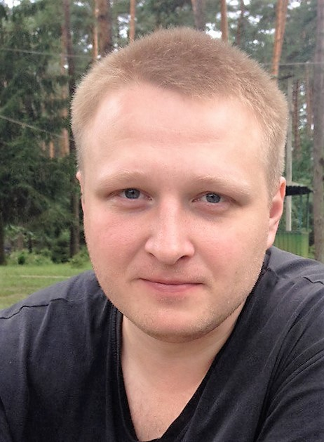

    

# Samonenko Sergey Leonidovich

**Date of birth:** 12/16/1986 (29 years)

**Phone:** +38 (050) 647- 85 -59

**E-mail:** [sergeysamon@gmail.com](sergeysamon@gmail.com), [dev.sergey.samon@gmail.com](dev.sergey.samon@gmail.com)

**Skype:** sergeysamon972

## Key skills:
* HTML 5, CSS3, Bootstrap 3/4;
* SASS/SCSS, jade (pug), nunjucks;
* ES5/ES6, jQuery, Ajax, WebSocket;
* Node.js, Express.js;
* mongoDB, sequelize;
* Gulp;
* Git;
* Adobe Photoshop.

## Education:
* Chernihiv National Technological University. Speciality: Electrical networks and systems;
* CyberBionic Systematics, course of Frontend Developer.

## Specialization:
* Good knowledge HTML & CSS;
* Use of semantic mark-up;
* Development for responsive/adaptive;
* Animation;
* Use of Preprocessors (SASS/SCSS);
* Development of email templates;
* JavaScript knowledge (ES5/ES6);
* Bootstrap, JQuery;
* Node.js (Express.js + mongoose or sequelize);
* Knowledge of OOP;
* Experience in using Adobe Photoshop (cutting the layout).

## Personal Skills:
* Languages: Ukrainian – native, Russian – fluent, English -  reading technical documents;
* Ability to learn new technologies quickly;
* Team player;
* Fast research and learning skills;
* Responsibility;
* Almost without bad habits.
